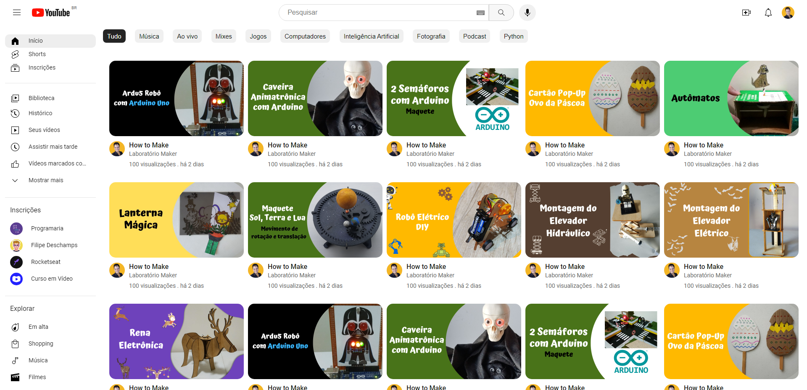
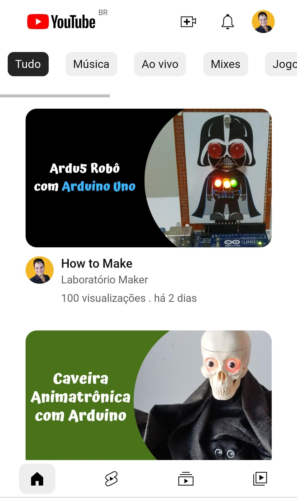
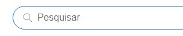
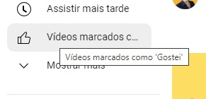

<h1 align="center"> Clone YouTube </h1>

  <a href="#-tecnologias">Tecnologias</a>&nbsp;&nbsp;&nbsp;|&nbsp;&nbsp;&nbsp;
  <a href="#-projeto">Projeto</a>&nbsp;&nbsp;&nbsp;|&nbsp;&nbsp;&nbsp;
  <a href="#-layout">Layout</a>&nbsp;&nbsp;&nbsp;|&nbsp;&nbsp;&nbsp;
  <a href="#memo-licença">Licença</a>

  

 

## 🚀 Tecnologias

Esse projeto foi desenvolvido com as seguintes tecnologias:

- HTML e CSS
- Git e Github

## 💻 Projeto

É uma cópia da interface principal do YouTube. Falta fazer a responsividade

- [Visite o projeto online](https://patyfil.github.io/clone-youtube/)

## 🔖 Layout

  
  

  
  

## :memo: Licença

Esse projeto está sob a licença MIT.

---

Feito com ♥ by Patrícia 
